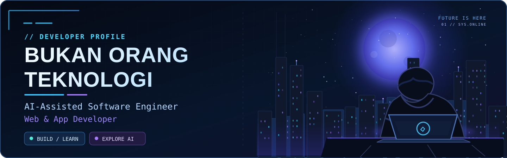

<div align="center">



<br />


<br />

### <span>AI-Assisted Software Engineer · Web & App Developer</span>

<p><em>Build. Learn. Improve. Repeat.</em></p>

<p>
  
  <strong>Indonesia</strong>
</p>

</div>

---

## About Me

<table>
<tr>
<td>

```text
🔴 🟡 🟢  itsbukanorang@github — zsh
```


</td>
</tr>
</table>

I build practical software with a focus on **web applications**, **backend systems**, **automation**, and **AI-assisted development workflows**.

---

## Tech Stack

<p align="center">
  
</p>

<p align="center">
  <strong>Go</strong> •
  <strong>Python</strong> •
  <strong>JavaScript</strong> •
  <strong>TypeScript</strong> •
  <strong>React</strong> •
  <strong>Node.js</strong> •
  <strong>PostgreSQL</strong> •
  <strong>Redis</strong> •
  <strong>Docker</strong> •
  <strong>Nginx</strong> •
  <strong>Linux</strong> •
  <strong>Git</strong>
</p>

---

## GitHub Activity

<p align="center">
  
  
</p>

<p align="center">
  <a href="https://github.com/itsbukanorang?tab=overview">View full contribution calendar on GitHub</a>
</p>

---

<div align="center">

**🇮🇩 Bukan Orang Teknologi**  
*Future Is Here.*

</div>
