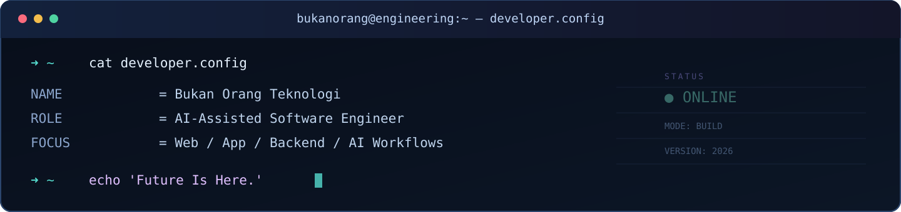
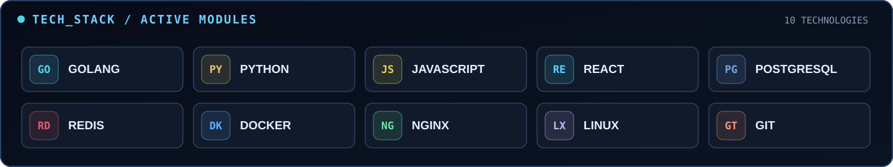

 

**`> BUILD WITH PURPOSE`** &nbsp; · &nbsp; **`> LEARN CONTINUOUSLY`** &nbsp; · &nbsp; **`> SHIP BETTER SOFTWARE`**

 

### `01 / SYSTEM IDENTITY`

I build and explore web applications, backend systems, and practical software tools with **AI-assisted development workflows**. My approach is simple: understand the problem, design carefully, build iteratively, and keep learning.

### `02 / TECHNOLOGY STACK`

### `03 / ENGINEERING FOCUS`

| `MODULE` | `WHAT I WORK ON` |
| :--- | :--- |
| `01 // WEB` | Responsive frontends and practical user experiences |
| `02 // BACKEND` | APIs, application logic, databases, and integrations |
| `03 // AI` | AI-assisted development and useful automation workflows |
| `04 // INFRA` | Linux server operations, deployment, and monitoring |

### `04 / SELECTED WORK`

Most of my current engineering work is in **private repositories**. I share public repositories as projects become ready to showcase. Nothing confidential or production-sensitive is published here.

### `05 / GITHUB ACTIVITY`

Activity graph reflects public contribution data available to the provider. GitHub's native contribution calendar remains the authoritative profile view.

---

**`BUKAN ORANG TEKNOLOGI`**

*Future Is Here.*

[**GitHub Profile**](https://github.com/itsbukanorang)

